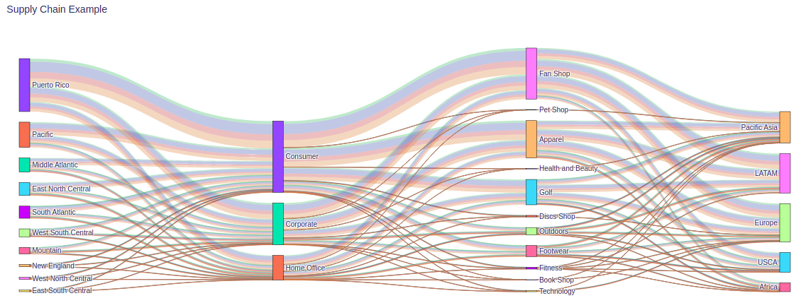

# sankey_easyplot

Library to help in plotting Plotly's Sankey Charts. It can make the plot by only providing the DataFrame and columns for the nodes.

## Example

The Example.ipynb shows an example of how to run the library.
The result is a interactive plotly chart like the figure below:

